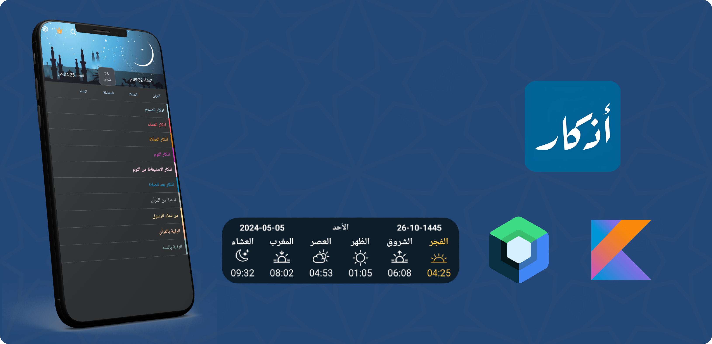

 

<h1 align="center">Athkar</h1>

 

 
 
 

 

<h4 align = "center">
 Athkar App is Prayer remembrance specialized application designed to assist Muslims in performing the five daily prayers regularly and to remind them of important supplications associated with prayer. 
  
  
 This app offers a variety of features aimed at facilitating users' organization and enhancement of their religious experience
</h4>

 

# Implemented Widget With Dynamic color

# AthkarApp
- Knowing prayer times and notify 
- read athkar from Quran and sunnah
- counter althker
 # Libraries
 
 - Room for the data persistence.
 - Work Manager for background job.
 - Kotlin Coroutines.
 - Kotlin Flows.
 - Gson for serialization/deserialization.
 - Dagger Hilt dependency injection.
 - MVVM architecture. 
 - Retrofit
 - material 3
 - support light and dark mode
 - Alarm Manager
 - 

 
 # Screenshots
 
 &emsp;&emsp;&emsp;
 
 &emsp;&emsp;&emsp;
 &emsp;
