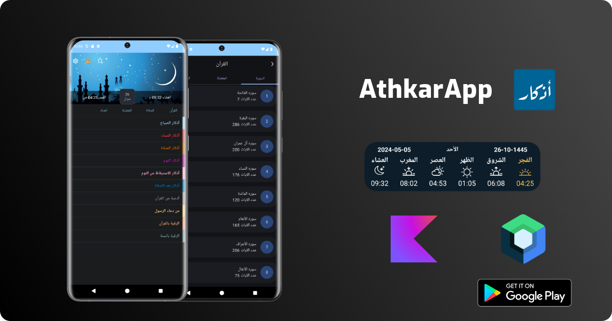

 

<h1 align="center">Athkar</h1>

 

 
 

 

<h4 align = "center">
 Athkar App is Prayer remembrance specialized application designed to assist Muslims in performing the five daily prayers regularly and to remind them of important supplications associated with prayer. 
  
  
 This app offers a variety of features aimed at facilitating users' organization and enhancement of their religious experience
</h4>

 

# ⬇️ Download
<a href="https://play.google.com/store/apps/details?id=com.athkar.sa">

# Features ✨
- Prayer times reminder
- Read Athkar
- Listen Quran and download surah
- Calander Pray Times
- Counter
- Add favorite Althker
- Add Widget to home screen prayers times

# Built with 🛠
### Kotlin
### Coroutines
### Jetpack Compose
### [Fused Location Aware](https://developer.android.com/develop/sensors-and-location/location/retrieve-current)  is used to get current location to get info prays times
### Material 3
### Single activity using navigaion component
### [Hilt Dependency injection](https://developer.android.com/training/dependency-injection/hilt-android)
### Room database
### DataStore
### WorkManager
### Splash Screen
### Gson
### Firebase
### Exo Play 3 media

 # Screenshots
 
 &emsp;&emsp;&emsp;
 
 &emsp;&emsp;&emsp;
   
  
 

